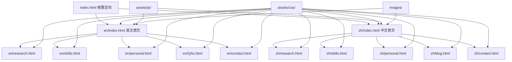

# 项目结构清理与优化设计文档

## 概述

本设计文档基于需求分析，为个人主页项目提供全面的结构清理、文件归档和维护指南方案。设计重点关注保持现有功能完整性的同时，建立清晰、可维护的项目结构。

## 架构设计

### 目标项目结构

```
个人主页项目 (根目录)
├── 📁 en/                    # 英文版本页面
│   ├── index.html            # 英文首页
│   ├── research.html         # 英文研究页面
│   ├── skills.html           # 英文技能页面
│   ├── personal.html         # 英文个人页面
│   ├── QAs.html             # 英文问答页面
│   └── contact.html          # 英文联系页面
├── 📁 zh/                    # 中文版本页面
│   ├── index.html            # 中文首页
│   ├── research.html         # 中文研究页面
│   ├── skills.html           # 中文技能页面
│   ├── personal.html         # 中文个人页面
│   ├── blog.html            # 中文博客页面
│   └── contact.html          # 中文联系页面
├── 📁 assets/                # 共享资源目录
│   ├── 📁 css/              # 样式文件
│   ├── 📁 js/               # JavaScript文件
│   ├── 📁 sass/             # SASS源文件
│   ├── 📁 webfonts/         # 字体文件
│   └── Qingguang_ZHENG_CV_2509.pdf  # 简历文件
├── 📁 images/                # 图片资源
├── 📁 shared/                # 共享组件和配置
├── 📁 legacy/                # 归档的历史文件
│   ├── 📁 root-pages/       # 原根目录页面
│   ├── 📁 old-scripts/      # 旧版脚本
│   └── 📁 deprecated/       # 废弃文件
├── 📁 .kiro/                 # Kiro配置和规范
├── 📁 .vscode/               # VS Code配置
├── 📁 .git/                  # Git版本控制
├── index.html                # 根目录重定向页面
├── local-server.py           # Python本地服务器
├── local-server.js           # Node.js本地服务器
├── start-local-server.bat    # Windows启动脚本
├── start-local-server.sh     # Unix启动脚本
├── README.md                 # 项目说明文档
├── PROJECT_STRUCTURE.md      # 项目结构说明
├── MAINTENANCE_GUIDE.md      # 维护指南
└── CNAME                     # 域名配置
```

### 文件归档策略

#### 需要归档的文件
```
legacy/root-pages/
├── contact.html              # 原根目录联系页面
├── elements.html             # 元素展示页面
├── generic.html              # 通用模板页面
├── personal.html             # 原根目录个人页面
├── QAs.html                  # 原根目录问答页面
├── research.html             # 原根目录研究页面
├── skills.html               # 原根目录技能页面
├── spacing-test.html         # 间距测试页面
├── styling-examples.html     # 样式示例页面
└── test-unified-controls.html # 控件测试页面

legacy/old-scripts/
├── create-chinese-pages.py   # 中文页面生成脚本
└── create-english-pages.py   # 英文页面生成脚本

legacy/deprecated/
├── DESIGN_SYSTEM.md          # 旧版设计系统文档
├── LOCAL_TESTING_GUIDE.md    # 旧版测试指南
├── MULTILINGUAL_SUMMARY.md   # 多语言总结文档
├── STYLING_GUIDE.md          # 旧版样式指南
└── README.txt                # 旧版说明文件
```

## 组件和接口设计

### 核心文件功能定义

#### 1. 根目录文件
- **index.html**: 语言检测和重定向页面
  - 功能: 自动检测用户语言偏好，重定向到对应语言版本
  - 依赖: `assets/js/root-language-redirect.js`
  - 修改频率: 很少

#### 2. 多语言页面目录
- **en/**: 英文版本页面（学术申请导向）
  - 目标受众: PhD招生委员会、国际合作者
  - 内容风格: 正式、学术、专业
  - 更新频率: 定期更新研究进展

- **zh/**: 中文版本页面（个人博客导向）
  - 目标受众: 中文读者、学术同行
  - 内容风格: 相对轻松、个人化
  - 更新频率: 不定期更新个人思考

#### 3. 资源管理
- **assets/**: 共享资源目录
  - `css/`: 样式文件，按功能模块组织
  - `js/`: JavaScript文件，按功能分类
  - `sass/`: SASS源文件（如果使用）
  - `webfonts/`: 字体文件

- **images/**: 图片资源
  - 命名规范: `pic01.jpg`, `pic02.jpg` 等
  - 优化建议: 使用WebP格式，压缩大小

#### 4. 开发工具
- **本地服务器**: 
  - `local-server.py`: Python版本（推荐）
  - `local-server.js`: Node.js版本
  - 启动脚本: 跨平台支持

### 页面依赖关系图



## 数据模型

### 文件分类模型
```javascript
{
  activeFiles: {
    pages: {
      english: ["en/index.html", "en/research.html", ...],
      chinese: ["zh/index.html", "zh/research.html", ...]
    },
    assets: {
      styles: ["assets/css/main.css", "assets/css/design-system.css", ...],
      scripts: ["assets/js/main.js", "assets/js/multilingual.js", ...],
      images: ["images/logo.svg", "images/pic01.jpg", ...]
    },
    config: ["CNAME", "local-server.py", "start-local-server.bat", ...]
  },
  
  legacyFiles: {
    rootPages: ["contact.html", "research.html", "skills.html", ...],
    oldScripts: ["create-chinese-pages.py", "create-english-pages.py"],
    deprecated: ["DESIGN_SYSTEM.md", "LOCAL_TESTING_GUIDE.md", ...]
  }
}
```

### 页面更新工作流
```javascript
{
  contentUpdate: {
    singleLanguage: {
      steps: [
        "1. 编辑对应语言目录下的HTML文件",
        "2. 更新相关的CSS样式（如需要）",
        "3. 测试页面显示效果",
        "4. 检查链接和导航功能"
      ]
    },
    
    multiLanguage: {
      steps: [
        "1. 更新英文版本内容",
        "2. 对应更新中文版本内容",
        "3. 检查语言切换功能",
        "4. 验证两个版本的一致性"
      ]
    },
    
    newPage: {
      steps: [
        "1. 在对应语言目录创建HTML文件",
        "2. 添加到导航菜单",
        "3. 更新语言切换逻辑",
        "4. 测试新页面功能"
      ]
    }
  }
}
```

## 错误处理

### 文件移动安全检查
1. **依赖关系检查**: 移动文件前检查是否被其他文件引用
2. **备份策略**: 重要操作前创建备份
3. **渐进式移动**: 分批移动文件，每次验证功能正常
4. **回滚机制**: 出现问题时快速恢复

### 链接完整性验证
1. **内部链接检查**: 确保页面间链接正常工作
2. **资源引用验证**: 检查CSS、JS、图片等资源引用
3. **多语言链接**: 验证语言切换功能
4. **外部链接**: 定期检查外部链接有效性

## 测试策略

### 结构清理测试
1. **文件移动测试**: 验证归档操作不破坏现有功能
2. **链接完整性测试**: 检查所有页面链接正常工作
3. **资源加载测试**: 确保CSS、JS、图片正常加载
4. **多语言功能测试**: 验证语言切换和内容显示

### 维护操作测试
1. **新页面添加测试**: 验证添加新页面的完整流程
2. **内容更新测试**: 测试内容修改和发布流程
3. **本地开发测试**: 验证本地服务器和开发环境
4. **性能影响测试**: 确保结构调整不影响页面性能

## 维护指南设计

### 文档结构
```
docs/
├── PROJECT_STRUCTURE.md      # 项目结构详细说明
├── MAINTENANCE_GUIDE.md      # 日常维护操作指南
├── DEVELOPMENT_SETUP.md      # 开发环境配置
├── CONTENT_UPDATE_GUIDE.md   # 内容更新指南
├── TROUBLESHOOTING.md        # 常见问题解决
└── FUTURE_PLANNING.md        # 未来扩展规划
```

### 操作检查清单
```markdown
## 添加新页面检查清单
- [ ] 在正确的语言目录创建HTML文件
- [ ] 使用统一的页面模板和样式
- [ ] 添加到导航菜单
- [ ] 更新语言切换逻辑
- [ ] 测试页面显示和功能
- [ ] 检查响应式设计
- [ ] 验证SEO元数据
- [ ] 更新站点地图（如有）

## 内容更新检查清单
- [ ] 备份原始内容
- [ ] 更新目标页面内容
- [ ] 检查格式和样式
- [ ] 验证链接和引用
- [ ] 测试多设备显示
- [ ] 同步更新其他语言版本（如需要）
- [ ] 提交版本控制
```

## 性能优化策略

### 文件组织优化
1. **CSS优化**: 
   - 按功能模块组织样式文件
   - 使用CSS变量统一设计系统
   - 压缩和合并CSS文件

2. **JavaScript优化**:
   - 按需加载脚本文件
   - 使用现代ES6+语法
   - 避免重复代码

3. **图片优化**:
   - 使用适当的图片格式
   - 实现响应式图片
   - 考虑懒加载机制

### 缓存策略
1. **静态资源缓存**: 为CSS、JS、图片设置合适的缓存头
2. **版本控制**: 使用文件版本号避免缓存问题
3. **CDN考虑**: 为未来CDN部署预留配置

## 未来扩展设计

### 技术升级路径
1. **构建工具集成**: 
   - 考虑引入Webpack或Vite
   - 自动化CSS预处理
   - JavaScript模块化

2. **内容管理系统**:
   - 考虑使用静态站点生成器
   - 实现内容和样式分离
   - 自动化部署流程

3. **交互功能增强**:
   - 添加搜索功能
   - 实现评论系统
   - 集成分析工具

### 扩展性考虑
1. **多语言支持**: 为更多语言版本预留空间
2. **内容类型扩展**: 支持博客、项目展示等新内容类型
3. **API集成**: 为动态内容加载预留接口
4. **移动应用**: 考虑PWA或移动应用扩展

这个设计文档为项目结构清理和优化提供了全面的技术指导，确保在保持现有功能完整性的同时，建立清晰、可维护的项目结构。