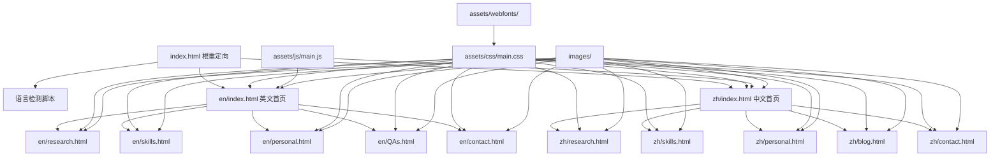

# 项目结构说明文档

## 概述

本文档详细说明个人主页项目的文件组织结构、各文件功能、依赖关系以及维护注意事项。项目采用多语言静态网站架构，支持中英文双语版本，具有清晰的文件组织和资源管理策略。

## 项目结构总览

```
个人主页项目/
├── 📁 .git/                     # Git版本控制目录
├── 📁 .kiro/                    # Kiro AI助手配置目录
│   └── 📁 specs/                # 项目规范和任务文档
├── 📁 .vscode/                  # VS Code编辑器配置
├── 📁 assets/                   # 共享资源目录
│   ├── 📁 css/                  # 样式文件
│   ├── 📁 js/                   # JavaScript脚本
│   ├── 📁 sass/                 # SASS预处理器文件
│   ├── 📁 webfonts/             # 网页字体文件
│   └── Qingguang_ZHENG_CV_2509.pdf  # 个人简历PDF
├── 📁 docs/                     # 文档目录（空）
├── 📁 en/                       # 英文版本页面
│   ├── contact.html             # 英文联系页面
│   ├── index.html               # 英文首页
│   ├── personal.html            # 英文个人页面
│   ├── QAs.html                 # 英文问答页面
│   ├── research.html            # 英文研究页面
│   └── skills.html              # 英文技能页面
├── 📁 images/                   # 图片资源目录
│   ├── logo.svg                 # 网站Logo
│   └── pic01.jpg ~ pic15.jpg    # 页面图片资源
├── 📁 legacy/                   # 历史文件归档目录
│   ├── 📁 deprecated/           # 废弃的文档和文件
│   ├── 📁 old-scripts/          # 旧版页面生成脚本
│   └── 📁 root-pages/           # 原根目录页面文件
├── 📁 shared/                   # 共享组件和配置
│   ├── 📁 components/           # 可复用组件
│   ├── 📁 config/               # 配置文件
│   ├── 📁 content/              # 共享内容
│   ├── 📁 data/                 # 数据文件
│   ├── 📁 docs/                 # 共享文档
│   ├── 📁 templates/            # 页面模板
│   └── 📁 test/                 # 测试文件
├── 📁 zh/                       # 中文版本页面
│   ├── blog.html                # 中文博客页面
│   ├── contact.html             # 中文联系页面
│   ├── index.html               # 中文首页
│   ├── personal.html            # 中文个人页面
│   ├── research.html            # 中文研究页面
│   └── skills.html              # 中文技能页面
├── CNAME                        # GitHub Pages域名配置
├── index.html                   # 根目录语言重定向页面
├── LICENSE.txt                  # 项目许可证
├── local-server.js              # Node.js本地开发服务器
├── local-server.py              # Python本地开发服务器
├── start-local-server.bat       # Windows启动脚本
└── start-local-server.sh        # Unix/Linux启动脚本
```

## 核心文件功能说明

### 1. 根目录文件

#### index.html
- **功能**: 语言检测和重定向入口页面
- **作用**: 根据用户浏览器语言偏好自动跳转到对应语言版本
- **依赖**: 可能依赖JavaScript进行语言检测
- **修改频率**: 很少修改
- **注意事项**: 
  - 修改时确保重定向逻辑正确
  - 保持简洁，避免复杂的样式和脚本
  - 提供手动语言选择选项作为备选

#### CNAME
- **功能**: GitHub Pages自定义域名配置
- **作用**: 指定网站的自定义域名
- **修改频率**: 很少修改
- **注意事项**: 
  - 只包含域名，不包含协议或路径
  - 修改后需要重新配置DNS

#### LICENSE.txt
- **功能**: 项目开源许可证
- **作用**: 说明项目的使用和分发条款
- **修改频率**: 很少修改

### 2. 本地开发服务器

#### local-server.py
- **功能**: Python版本的本地HTTP服务器
- **作用**: 提供本地开发和测试环境
- **依赖**: Python 3.x环境
- **使用方法**: `python local-server.py`
- **默认端口**: 通常为8000
- **注意事项**: 
  - 推荐使用的本地服务器版本
  - 支持静态文件服务和基本的HTTP功能

#### local-server.js
- **功能**: Node.js版本的本地HTTP服务器
- **作用**: 替代的本地开发服务器选项
- **依赖**: Node.js环境
- **使用方法**: `node local-server.js`

#### 启动脚本
- **start-local-server.bat**: Windows批处理启动脚本
- **start-local-server.sh**: Unix/Linux Shell启动脚本
- **作用**: 简化本地服务器启动过程
- **注意事项**: 确保脚本具有执行权限

## 多语言页面目录

### 英文版本 (en/)

英文版本面向国际受众，特别是学术申请和国际合作场景。

#### 页面文件说明
- **index.html**: 英文首页，展示个人简介和主要成就
- **research.html**: 研究页面，详细介绍研究方向和成果
- **skills.html**: 技能页面，展示技术能力和专业技能
- **personal.html**: 个人页面，分享个人经历和兴趣
- **QAs.html**: 问答页面，回答常见问题
- **contact.html**: 联系页面，提供联系方式和表单

#### 内容特点
- **目标受众**: PhD招生委员会、国际合作者、学术同行
- **语言风格**: 正式、学术、专业
- **更新频率**: 定期更新，特别是研究进展部分
- **SEO优化**: 针对英文关键词优化

### 中文版本 (zh/)

中文版本面向中文读者，具有更个人化的内容风格。

#### 页面文件说明
- **index.html**: 中文首页，个人介绍和近期动态
- **research.html**: 研究页面，研究内容的中文介绍
- **skills.html**: 技能页面，技术能力展示
- **personal.html**: 个人页面，个人经历和思考
- **blog.html**: 博客页面，个人博客和文章
- **contact.html**: 联系页面，中文联系信息

#### 内容特点
- **目标受众**: 中文读者、国内学术同行、朋友
- **语言风格**: 相对轻松、个人化、易读
- **更新频率**: 不定期更新，包含个人思考和生活分享
- **本地化**: 适应中文阅读习惯和文化背景

## 资源文件组织

### assets/ 目录结构

#### css/ 样式文件
```
assets/css/
├── main.css              # 主要样式文件
├── design-system.css     # 设计系统样式
├── responsive.css        # 响应式设计样式
└── [其他CSS文件]         # 功能特定样式
```

**组织规则**:
- 按功能模块组织样式文件
- 使用CSS变量统一设计系统
- 保持样式的模块化和可维护性
- 避免样式冲突和重复

**命名约定**:
- 使用kebab-case命名 (例: `main-navigation.css`)
- 功能描述性命名 (例: `responsive-layout.css`)
- 避免使用缩写，保持名称清晰

#### js/ JavaScript文件
```
assets/js/
├── main.js               # 主要脚本文件
├── multilingual.js       # 多语言功能脚本
├── navigation.js         # 导航功能脚本
└── [其他JS文件]          # 功能特定脚本
```

**组织规则**:
- 按功能分离JavaScript文件
- 使用现代ES6+语法
- 避免全局变量污染
- 实现模块化加载

**加载顺序**:
1. 基础库和框架
2. 核心功能脚本
3. 页面特定脚本
4. 初始化脚本

#### webfonts/ 字体文件
- **作用**: 存储网页字体文件
- **格式**: WOFF, WOFF2, TTF等
- **注意事项**: 
  - 优先使用WOFF2格式以获得更好的压缩率
  - 提供字体格式回退方案
  - 考虑字体加载性能

#### sass/ SASS预处理器文件
- **作用**: SASS/SCSS源文件存储
- **编译**: 需要编译为CSS文件
- **组织**: 按组件和功能模块组织

### images/ 图片资源

#### 命名规范
- **通用图片**: `pic01.jpg`, `pic02.jpg`, `pic03.jpg` 等
- **功能图片**: `logo.svg`, `avatar.jpg`, `background.jpg` 等
- **图标**: `icon-email.svg`, `icon-github.svg` 等

#### 优化建议
- **格式选择**: 
  - 照片使用JPEG格式
  - 图标和简单图形使用SVG格式
  - 需要透明背景的使用PNG格式
- **压缩**: 使用适当的压缩级别平衡质量和文件大小
- **响应式**: 为不同屏幕尺寸提供适当的图片版本

## 文件依赖关系图



## 资源引用关系

### CSS依赖链
```
页面HTML文件
    ↓ 引用
assets/css/main.css
    ↓ 可能引用
assets/css/design-system.css
assets/css/responsive.css
    ↓ 引用
assets/webfonts/ (字体文件)
```

### JavaScript依赖链
```
页面HTML文件
    ↓ 引用
assets/js/main.js
    ↓ 可能依赖
assets/js/multilingual.js
assets/js/navigation.js
```

### 图片引用关系
```
CSS文件 → images/ (背景图片、图标)
HTML文件 → images/ (内容图片、Logo)
```

## 多语言版本管理

### 语言版本对应关系

| 功能页面 | 英文版本 | 中文版本 | 说明 |
|---------|---------|---------|------|
| 首页 | en/index.html | zh/index.html | 主要入口页面 |
| 研究 | en/research.html | zh/research.html | 研究内容展示 |
| 技能 | en/skills.html | zh/skills.html | 技能和能力 |
| 个人 | en/personal.html | zh/personal.html | 个人经历 |
| 问答 | en/QAs.html | - | 仅英文版本 |
| 博客 | - | zh/blog.html | 仅中文版本 |
| 联系 | en/contact.html | zh/contact.html | 联系方式 |

### 内容同步策略

#### 核心内容同步
- **研究成果**: 两个语言版本应保持核心信息一致
- **技能展示**: 技术技能部分应该同步更新
- **联系信息**: 联系方式必须保持一致

#### 差异化内容
- **个人页面**: 可以根据目标受众调整内容风格
- **博客内容**: 中文版本可以包含更多个人思考
- **问答页面**: 英文版本针对国际受众的常见问题

### 语言切换实现

#### 技术方案
1. **URL结构**: `/en/page.html` 和 `/zh/page.html`
2. **语言检测**: 基于浏览器Accept-Language头
3. **用户选择**: 提供手动语言切换选项
4. **记忆功能**: 使用localStorage记住用户选择

#### 实现注意事项
- 确保每个页面都有对应的语言版本链接
- 处理不存在对应页面的情况
- 提供清晰的语言切换界面
- 考虑SEO优化，使用hreflang标签

## 修改注意事项

### 页面内容修改

#### 单语言页面更新
1. **备份**: 修改前创建文件备份
2. **测试**: 在本地环境测试修改效果
3. **验证**: 检查链接和资源引用
4. **同步**: 考虑是否需要同步更新其他语言版本

#### 多语言同步更新
1. **计划**: 制定两个语言版本的更新计划
2. **一致性**: 确保核心信息在两个版本中保持一致
3. **本地化**: 根据目标受众调整表达方式
4. **测试**: 测试语言切换功能

### 样式和脚本修改

#### CSS修改
- **模块化**: 尽量在特定的CSS文件中进行修改
- **兼容性**: 考虑不同浏览器的兼容性
- **响应式**: 确保修改不破坏响应式设计
- **性能**: 避免添加不必要的样式规则

#### JavaScript修改
- **功能测试**: 在不同浏览器中测试JavaScript功能
- **错误处理**: 添加适当的错误处理机制
- **性能**: 避免阻塞页面加载的脚本
- **兼容性**: 考虑旧版浏览器的支持

### 资源文件管理

#### 添加新图片
1. **优化**: 压缩图片文件大小
2. **命名**: 使用描述性的文件名
3. **格式**: 选择合适的图片格式
4. **引用**: 更新相关的HTML和CSS文件

#### 字体文件更新
1. **格式**: 提供多种字体格式以确保兼容性
2. **加载**: 优化字体加载性能
3. **回退**: 设置合适的字体回退方案

## 版本控制建议

### Git工作流程
1. **分支策略**: 使用feature分支进行开发
2. **提交信息**: 使用清晰描述性的提交信息
3. **代码审查**: 重要修改进行代码审查
4. **标签管理**: 为重要版本创建Git标签

### 备份策略
1. **定期备份**: 定期创建项目完整备份
2. **重要修改**: 重大修改前创建备份点
3. **测试环境**: 在测试环境验证修改
4. **回滚计划**: 准备快速回滚方案

## 性能优化指南

### 文件优化
- **CSS**: 压缩CSS文件，移除未使用的样式
- **JavaScript**: 压缩JS文件，使用模块化加载
- **图片**: 优化图片格式和大小
- **字体**: 使用字体子集，减少加载时间

### 加载优化
- **关键资源**: 优先加载关键CSS和JS
- **懒加载**: 对非关键图片实现懒加载
- **缓存**: 设置合适的缓存策略
- **CDN**: 考虑使用CDN加速资源加载

---

*本文档将随着项目发展持续更新，确保始终反映最新的项目结构和最佳实践。*